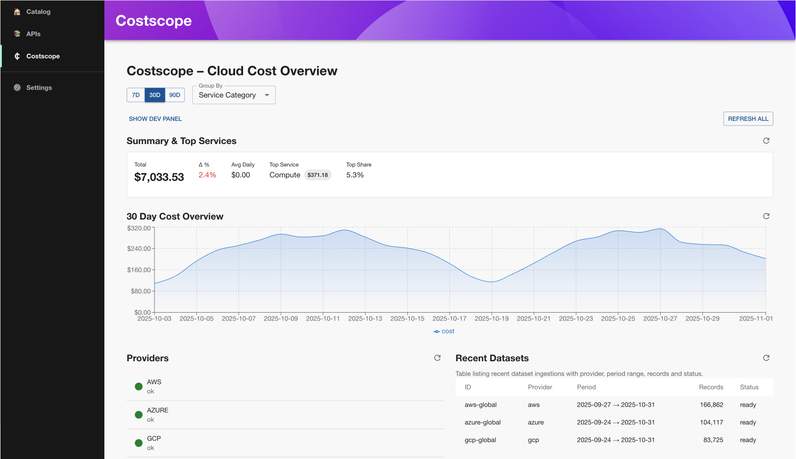
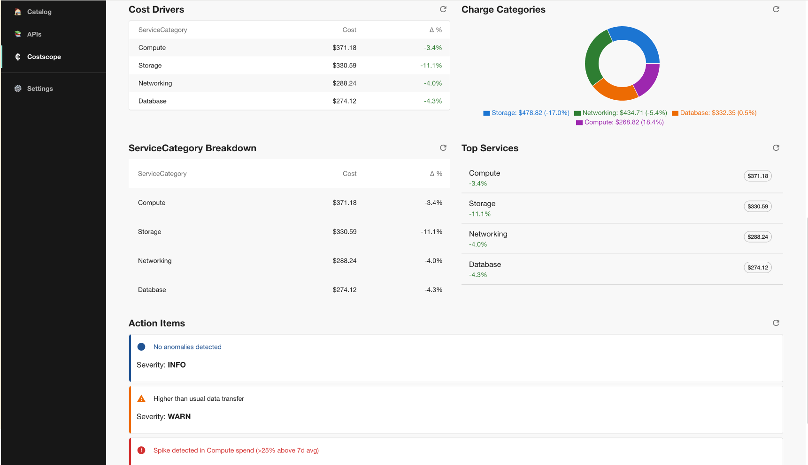
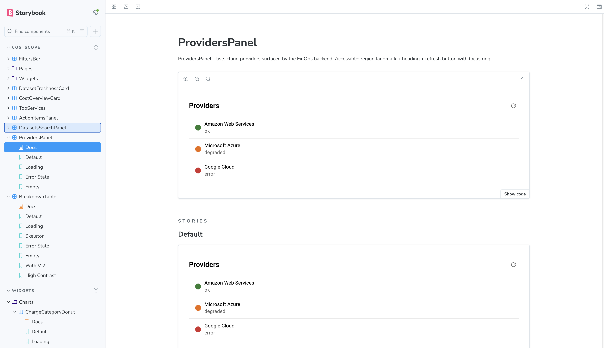

# Costscope Backstage Plugin

[](https://github.com/costscope/costscope-backstage-plugin/actions/workflows/ci.yml)
[](https://github.com/costscope/costscope-backstage-plugin/actions/workflows/codeql.yml)
[](https://securityscorecards.dev/viewer/?uri=github.com/costscope/costscope-backstage-plugin)
[](https://costscope.github.io/costscope-backstage-plugin/)
[](./LICENSE)

## What is Costscope?

Costscope is a powerful Backstage frontend plugin that brings multi-cloud FinOps cost insights directly into your developer portal. It seamlessly integrates with your Costscope API, normalizes data to the FOCUS specification, and delivers actionable cost analytics through intuitive charts, tables, and recommendations.

Designed for engineering teams, Costscope empowers developers to understand and optimize cloud spending without leaving their workflow. Whether you're tracking costs by project, service, or region, Costscope provides the visibility and insights needed to make informed decisions.

> Backend / API implementation lives here: <https://github.com/costscope/costscope>
>
> This plugin is UI-only. You must point it at a running Costscope backend API (self‑hosted or sandbox) via Backstage `discovery` (preferred) or a `proxy` entry. See Configuration below.

## Demo





```bash
npm run demo
```

More details: see [docs/demo.md](docs/demo.md).

## Storybook (local)



```bash
yarn storybook:dev
```

More details: see [docs/storybook.md](docs/storybook.md).

## Quick Start

Install the plugin in your Backstage app workspace:

```bash
yarn workspace app add @costscope/backstage-plugin
```

More details: see [docs/quick-start.md](docs/quick-start.md).

## Key Features

- **Multi-Cloud Cost Visibility**: Unified view across AWS, Azure, GCP, and other cloud providers
- **FOCUS-Native Analytics**: Standardized cost data using the FinOps Open Cost and Usage Specification
- **Real-Time Insights**: Live cost trends, breakdowns, and actionable recommendations
- **Developer-First UX**: Integrated directly into Backstage for seamless developer experience
- **Project Scoping**: Granular cost tracking by project, team, or service
- **Interactive Charts**: Beautiful, accessible visualizations powered by Recharts
- **Smart Caching**: Optimized performance with intelligent caching and retries
- **Accessibility Built-In**: WCAG-compliant components with full keyboard navigation
- **Extensible Architecture**: Easy integration with existing Backstage ecosystems

## Competitive Advantages

- **Unified Platform**: Single pane of glass for all cloud cost data vs. scattered vendor consoles
- **Developer Productivity**: Cost insights where developers already work, reducing context switching
- **Open Standards**: FOCUS compliance ensures vendor neutrality and future-proofing
- **Performance Optimized**: Lightweight bundle with lazy loading and efficient caching
- **Enterprise Ready**: Robust error handling, security, and scalability for large organizations
- **Community Driven**: Open-source with active development and community support
- **Backstage Native**: Deep integration with Backstage's plugin ecosystem and theming

## Documentation

Detailed docs live under `docs/`:

- [Quick Start](docs/quick-start.md)
- [Demo](docs/demo.md)
- [Storybook](docs/storybook.md)
- [Configuration & FAQ](docs/CONFIGURATION_AND_FAQ.md)
- [Architecture overview](docs/architecture.md)
- [Running tests locally](docs/testing-local.md)
- [Troubleshooting](docs/troubleshooting.md)

## License

Apache 2.0 - see [LICENSE](./LICENSE) file.
